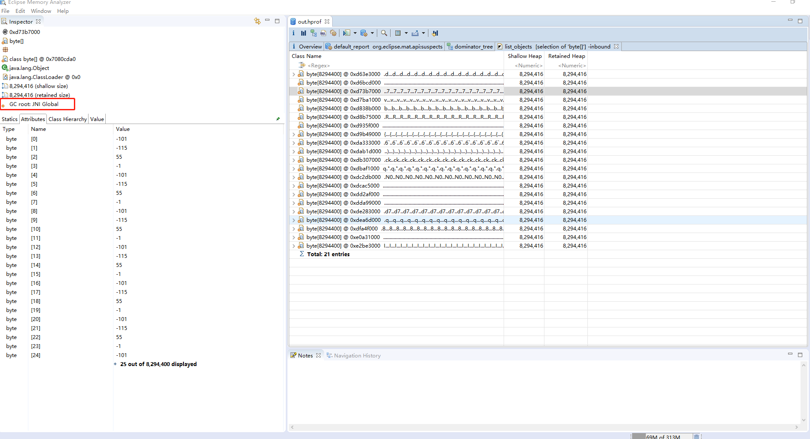

###                       Android 5.0~6.0系统，由于硬件加速引起的内存泄漏问题

### 实例



####  原因

[DisplayListCanvas.cpp](https://android.googlesource.com/platform/frameworks/base/+/refs/tags/android-6.0.1_r81/libs/hwui/DisplayListCanvas.cpp)

```java
......
void DisplayListCanvas::drawBitmap(const SkBitmap* bitmap, const SkPaint* paint) {
    bitmap = refBitmap(*bitmap);
    paint = refPaint(paint);
    addDrawOp(new (alloc()) DrawBitmapOp(bitmap, paint));
}
```

硬件加速原理此处不深入讨论，主要是将绘制操作分别保存到DisplayListData中，这样如果某个ChildView更新了，那么只需更新该ChildView对应的DisplayListData就行，不需要更新整个ViewTree。例如上面这段绘制bitmap的代码，DisplayListCanvas会将bitmap保存到DisplayListData中，换句话说就是DisplayListData存在对于bitmap的引用。那么这个DisplayListData什么时候会释放呢？

[View.java](https://android.googlesource.com/platform/frameworks/base/+/refs/tags/android-6.0.1_r81/core/java/android/view/View.java)

```java
    ......
    private void cleanupDraw() {
        resetDisplayList();
        if (mAttachInfo != null) {
            mAttachInfo.mViewRootImpl.cancelInvalidate(this);
        }
    }
    
    ......
    @CallSuper
    protected void destroyHardwareResources() {
        resetDisplayList();
    }
    
    ......
    private void resetDisplayList() {
        if (mRenderNode.isValid()) {
            mRenderNode.destroyDisplayListData();
        }
        if (mBackgroundRenderNode != null && mBackgroundRenderNode.isValid()) {
            mBackgroundRenderNode.destroyDisplayListData();
        }
    }
```

事实上，View在detach或者不可见(GONE或INVISIBLE)的时候，都会重置DisplayList。这样来看，似乎逻辑上并没有什么问题，但是我们不妨接着往下看：

[RenderNode.java](https://android.googlesource.com/platform/frameworks/base/+/refs/tags/android-6.0.1_r81/core/java/android/view/RenderNode.java)

```java
    ......
    public void destroyDisplayListData() {
        if (!mValid) return;
        nSetDisplayListData(mNativeRenderNode, 0);
        mValid = false;
    }
```

[android_view_RenderNode.cpp](https://android.googlesource.com/platform/frameworks/base/+/refs/tags/android-6.0.1_r81/core/jni/android_view_RenderNode.cpp) 

```java
......
static void android_view_RenderNode_destroyRenderNode(JNIEnv* env,
        jobject clazz, jlong renderNodePtr) {
    RenderNode* renderNode = reinterpret_cast<RenderNode*>(renderNodePtr);
    renderNode->decStrong(0);
}

...... 
static void android_view_RenderNode_setDisplayListData(JNIEnv* env,
        jobject clazz, jlong renderNodePtr, jlong newDataPtr) {
    RenderNode* renderNode = reinterpret_cast<RenderNode*>(renderNodePtr);
    DisplayListData* newData = reinterpret_cast<DisplayListData*>(newDataPtr);
    renderNode->setStagingDisplayList(newData);
}
```
RenderNode.java的代码相对比较简单，可以看出 _destroyDisplayListData()_ 方法最后调用的是 _setStagingDisplayList()_ 方法。

[RenderNode.cpp](https://android.googlesource.com/platform/frameworks/base/+/refs/tags/android-6.0.1_r81/libs/hwui/RenderNode.cpp)
```java
......
// 刷新时触发
void RenderNode::setStagingDisplayList(DisplayListData* data) {
    mNeedsDisplayListDataSync = true;
    delete mStagingDisplayListData;
    mStagingDisplayListData = data;
}
```

_setStagingDisplayList()_  方法的逻辑也相对比较简单，但是问题恰恰就是因为这个逻辑太过于简单了：我们发现 _setStagingDisplayList()_ 方法仅仅只是清除了 _mStagingDisplayListData_，然而这个只是staging状态的缓存，对于已经绘制过得View来说，真正保存数据的是 _mDisplayListData_，而_mDisplayListData_ 并没有被清除。那么 _mDisplayListData_ 什么时候会被清除呢？

```cpp
// 绘制时触发
void RenderNode::pushStagingDisplayListChanges(TreeInfo& info) {
    if (mNeedsDisplayListDataSync) {
        mNeedsDisplayListDataSync = false;
        if (mStagingDisplayListData) {
            for (size_t i = 0; i < mStagingDisplayListData->children().size(); i++) {
                mStagingDisplayListData->children()[i]->mRenderNode->incParentRefCount();
            }
        }
        ......
        deleteDisplayListData();
        ......
        mDisplayListData = mStagingDisplayListData;
        mStagingDisplayListData = nullptr;
        ......
    }
}

// 父节点清除DisplayList
void RenderNode::deleteDisplayListData() {
    if (mDisplayListData) {
        for (size_t i = 0; i < mDisplayListData->children().size(); i++) {
            mDisplayListData->children()[i]->mRenderNode->decParentRefCount();
        }
        if (mDisplayListData->functors.size()) {
            Caches::getInstance().unregisterFunctors(mDisplayListData->functors.size());
        }
    }
    delete mDisplayListData;
    mDisplayListData = nullptr;
}

void RenderNode::decParentRefCount() {
    LOG_ALWAYS_FATAL_IF(!mParentCount, "already 0!");
    mParentCount--;
    if (!mParentCount) {
        destroyHardwareResources();
    }
}

void RenderNode::destroyHardwareResources() {
    if (mLayer) {
        LayerRenderer::destroyLayer(mLayer);
        mLayer = nullptr;
    }
    if (mDisplayListData) {
        for (size_t i = 0; i < mDisplayListData->children().size(); i++) {
            mDisplayListData->children()[i]->mRenderNode->destroyHardwareResources();
        }
        if (mNeedsDisplayListDataSync) {
            deleteDisplayListData();
        }
    }
}

// 析构函数
RenderNode::~RenderNode() {
    deleteDisplayListData();
    delete mStagingDisplayListData;
    if (mLayer) {
        ALOGW("Memory Warning: Layer %p missed its detachment, held on to for far too long!", mLayer);
        mLayer->postDecStrong();
        mLayer = nullptr;
    }
}
```

从代码上看，有三个场景会清除mDisplayListData，

* 子节点View刷新并绘制的时候，会清除旧数据；

* 子节点RenderNode执行析构函数的时候；

* 父节点清除mDisplayListData的时候，如果子节点的mParentCount为0（即子节点没有关联到任何父节点，这种情况一般出现在View被移除、隐藏、超出显示区域的时候），__并且mNeedsDisplayListDataSync为true（即子节点数据刷新未重绘或者数据重置未重绘）__

那么是不是只要Java层释放了对当前节点View的引用，并将其回收就可以呢？不一定，因为父节点的ViewGroup也存在对当前节点Native层RenderNode的引用，这个引用也需要释放，而问题恰恰就出现在这个地方。

不妨考虑一种场景：父节点刷新重绘，而子节点由于被移除或者超出显示区域而未能刷新重绘，此时父节点会释放对子节点的引用，子节点进入到 _destroyHardwareResources()_ 函数开始清除硬件加速缓存，__但是这个时候由于子节点数据既没有刷新也没有重置__，那么就不会执行 _deleteDisplayListData()_ 函数。而在这种情况下 _mDisplayListData_ 只有等到执行析构函数的时候才能被清除。

因此对于ViewPager + FrameLayout + ImageView 这样一个结构的布局，如果我们在destroyItem的时候才去释放bitmap资源，那么这个bitmap资源将无法及时被回收，只有等到FrameLayout被回收的时候，这个bitmap资源才能被回收。

幸运的是，绝大多数场景下，要么不需要使用ViewPager，要么FrameLayout是复用的，要么及时刷新重绘，因此即使有泄漏也只是短暂的（退出页面的时候也可以被回收）。


#### 解决

尽管这个问题不是特别严重，但是依然会占用消耗内存资源，因此针对该问题出现的场景，有上下两策可以选择：

* 其一，在父节点重绘(注意这里__特指即释放子节点引用的那次重绘__)之前，及时释放资源

* 其二，复用或者释放相关的View，尽管这样做可以减少泄漏，但是依然还是存在泄漏。

另外该问题只出现在5.0和6.0的系统上，7.0.0之后的版本Google官方已做修复，详情见：

[Free DisplayListData for Views with GONE parents](https://android.googlesource.com/platform/frameworks/base/+/9dea0d53f598d8fa98d9b50899fc9c7559f7a1a1)

```java
void RenderNode::setStagingDisplayList(DisplayList* displayList) {
    mNeedsDisplayListSync = true;
    delete mStagingDisplayList;
    mStagingDisplayList = displayList;
    // If mParentCount == 0 we are the sole reference to this RenderNode,
    // so immediately free the old display list
    if (!mParentCount && !mStagingDisplayList) {
        deleteDisplayList();
    }
}
```
我们看到，其核心也是在 _setStagingDisplayLis()_ 方法增加了判断及清除 _mDisplayListData_ 的逻辑。

附其他相关commit链接：

[Fix some edge cases](https://android.googlesource.com/platform/frameworks/base/+/51f2d606dcbfba3cc5b03dfea37c1304b91c232f)

[Add a callback for rendernode parentcount=0](https://android.googlesource.com/platform/frameworks/base/+/44b49f070aafe8ad44efae87341121cce49ff11c)


__Android 5.0以下系统暂未发现该问题，是因为Android 5.0对硬件加速模块做了一次较大的重构__，详见链接 [Switch DisplayListData to a staging model](https://android.googlesource.com/platform/frameworks/base/+/8de65a8e05285df52a1e6f0c1d5616dd233298a7)


但是从log上看，__Android 4.4以下也存在类似问题__，详见链接  [Fix hardware layers lifecycle](https://android.googlesource.com/platform/frameworks/base/+/46bfc4811094e5b1e3196246e457d4c6b58332ec)


#### ChildView不会被绘制的场景例举

首先，无需赘言，当ChildView__被移除__的时候，这个ChildView将不会被绘制。

[ViewGroup.java](https://android.googlesource.com/platform/frameworks/base/+/refs/tags/android-6.0.1_r81/core/java/android/view/ViewGroup.java)

```java
    @Override
    protected void dispatchDraw(Canvas canvas) {
    ......
        for (int i = 0; i < childrenCount; i++) {
            int childIndex = customOrder ? getChildDrawingOrder(childrenCount, i) : i;
            final View child = (preorderedList == null)
                    ? children[childIndex] : preorderedList.get(childIndex);
            if ((child.mViewFlags & VISIBILITY_MASK) == VISIBLE
                || child.getAnimation() != null) {
                more |= drawChild(canvas, child, drawingTime);
            }
        }
    ......
    }
```

其次，从ViewGroup的dispatchDraw方法来看，如果其ChildView__不可见且不在执行动画__，则该ChildView不会被绘制。


[View.java](https://android.googlesource.com/platform/frameworks/base/+/refs/tags/android-6.0.1_r81/core/java/android/view/View.java)

```java
    boolean draw(Canvas canvas, ViewGroup parent, long drawingTime) {
    ......
        concatMatrix |= !childHasIdentityMatrix;
        // Sets the flag as early as possible to allow draw() implementations
        // to call invalidate() successfully when doing animations
        mPrivateFlags |= PFLAG_DRAWN;
        if (!concatMatrix &&
                (parentFlags & (ViewGroup.FLAG_SUPPORT_STATIC_TRANSFORMATIONS |
                        ViewGroup.FLAG_CLIP_CHILDREN)) == ViewGroup.FLAG_CLIP_CHILDREN &&
                canvas.quickReject(mLeft, mTop, mRight, mBottom, Canvas.EdgeType.BW) &&
                (mPrivateFlags & PFLAG_DRAW_ANIMATION) == 0) {
            mPrivateFlags2 |= PFLAG2_VIEW_QUICK_REJECTED;
            return more;
        }
        mPrivateFlags2 &= ~PFLAG2_VIEW_QUICK_REJECTED;
    ......
    }

```

另外，从View的draw（drawChild的时候调用）方法可以看出，当ChildView__超出显示区域__的时候，该ChildView也不会被绘制。值得注意的是，如果是ViewGroup设置clipChildren为false的时候，因为这种场景无法判断这个ChildView的显示区域，因此这种情况下，会尝试绘制该ChildView。


